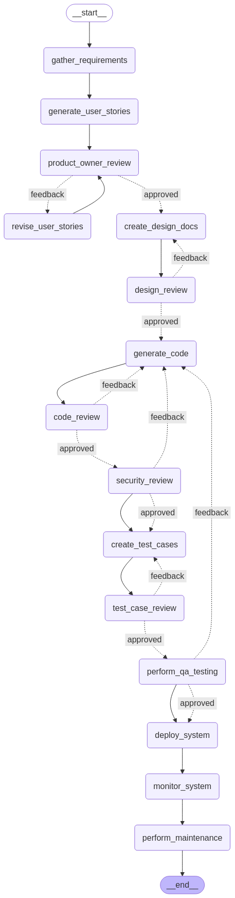

# 🚀 AI-Powered Multi-Lingual SDLC Automation with LangGraph, LLMs & Human-in-the-Loop

## Fully Automated & Deployed on Hugging Face! 💻⚙️

Imagine an intelligent, feedback-driven Software Development Lifecycle (SDLC) pipeline that can automatically generate user stories from requirements, manage iterative reviews, and seamlessly guide your code from concept to deployment — with built-in human approvals, code reviews, security checks, and QA, all orchestrated by LangGraph’s agentic framework.

This project demonstrates a revolutionary approach to software development, leveraging the power of AI and large language models (LLMs) to automate and streamline the entire SDLC, while keeping crucial human oversight and feedback loops integrated at every stage.

## ✨ Demo & Visuals

Here are some visuals demonstrating the application in action.

### Visual Workflow

Below is an image of the Full details workflow.

### Video Demonstration

Watch a short video demonstrating the key workflows of the AI-powered SDLC pipeline, from requirement input to automated steps and human review points.

## YouTube video.***
([[Link_to_Your_Video_on_YouTube_or_Other_Platform]](https://www.youtube.com/watch?v=XmjxdXFpOYM))
*Click the image above to watch the video demonstration.*

## 🎛️ How It Works: The Automated SDLC Pipeline

The system orchestrates a series of AI agents and human checkpoints to move from initial requirements to deployed code. Here's a breakdown of the key stages:

1.  **UI-Based Requirement Gathering:** An intuitive Streamlit UI allows users (e.g., product managers, stakeholders) to easily input software requirements.
2.  **Auto-Generate User Stories:** AI agents powered by Groq LLM transform the raw requirements into structured, actionable user stories.
3.  **Human-in-the-Loop Product Owner Review:** The generated user stories are presented for review. A designated human (e.g., Product Owner) provides feedback and approvals directly through the UI, with the system iteratively updating stories based on input.
4.  **Automated Design Document Generation:** Based on the approved user stories, AI generates functional and technical design documents.
5.  **Feedback-Driven Design Review Loop:** Design documents undergo review by relevant stakeholders (e.g., architects, leads) via the UI, with feedback driving iterative improvements and finalization.
6.  **Code Generation & Code Review Agents:** AI generates code snippets and components based on the finalized designs and user stories. Dedicated agents perform structured code reviews, identifying potential issues and suggesting revisions. Human code review checkpoints can also be integrated.
7.  **Security Review Automation:** Automated security analysis tools and AI agents perform checks for common vulnerabilities before the code progresses. Potential fixes or alerts are generated.
8.  **Test Case Generation & QA Feedback Loop:** AI generates comprehensive test cases (unit, integration, etc.). These are used for automated testing, and a feedback loop is established for QA engineers to provide manual testing results and bug reports, triggering automated or human-assisted fixes.
9.  **One-Click Deployment & Monitoring:** The finalized and approved code is deployed seamlessly (e.e.g., to a staging or production environment). Continuous monitoring agents track performance and errors.
10. **Maintenance & Updates Workflow:** Post-deployment issues or new feature requests can trigger new iterations of the workflow, managed efficiently by LangGraph.

## 🛠️ Tech Stack & Deployment

This project utilizes a powerful combination of modern AI and web technologies:

* **LangGraph (Agentic Workflow Framework):** Orchestrates the complex, iterative, and feedback-based workflows between AI agents and human participants.
* **Groq LLM + LangChain:** Provides the core AI capabilities for generating text (user stories, designs, code, test cases) and enabling smart decision-making within the agents.
* **Pydantic:** Used for data modeling and validation, ensuring structured and reliable data flow between different stages and agents in the workflow.
* **Streamlit:** Provides a simple, clean, and user-friendly interface for requirement input, review processes, and human-in-the-loop interactions.
* **Hugging Face:** Used as the deployment platform, enabling easy access and scalability for the application.

## 🎯 Why This Matters

Traditional, manual SDLC processes are often tedious, time-consuming, and prone to bottlenecks and delays. This AI-powered system offers significant advantages:

* ✅ **Automates the entire SDLC pipeline:** Reduces manual effort significantly across all stages.
* ✅ **Integrated Human Checkpoints:** Ensures quality assurance, critical thinking, and domain expertise are incorporated at key decision points.
* ✅ **Accelerates Development Cycles:** Speeds up time-to-market without compromising quality, security, or design integrity.
* ✅ **Eliminates Bottlenecks:** Feedback-driven iterative loops ensure progress isn't stalled waiting for sequential manual steps.
* ✅ **Accessible Automation:** Provides a user-friendly UI hosted on Hugging Face, making advanced AI-powered SDLC automation accessible.
* ✅ **Supports Multi-Lingual Development (Conceptual/Future):** The underlying LLM capabilities can be extended to support requirement gathering and code generation in multiple programming languages and human languages.

## 🚀 Getting Started

*(Instructions on how to set up and run the project would go here. This typically includes cloning the repository, installing dependencies, configuring API keys (e.g., for Groq), and running the Streamlit application. Since this is based on a description and not a live repo, this section is a placeholder.)*

1.  Clone the repository: `git clone [repository_url]`
2.  Navigate to the project directory: `cd [project_folder]`
3.  Install dependencies: `pip install -r requirements.txt`
4.  Set up necessary environment variables (e.g., API keys).
5.  Run the Streamlit application: `streamlit run app.py`
6.  Access the application via your web browser.

## Project Status

This project is currently a proof-of-concept or under active development showcasing the potential of AI and LangGraph for comprehensive SDLC automation.

---

Let’s talk about what excites you most about AI in SDLC automation! Join the conversation and share your thoughts.

